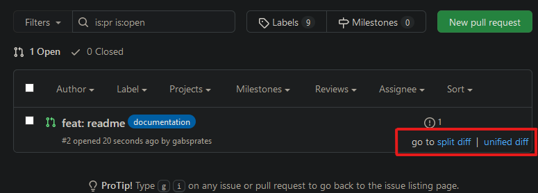

# go-to-diff

📄👀 Go to diff unified or split directly in a pull request

It creates two link on each pull request item (in pull requests page):

---

## To Install

It is not published yet, so you can install manually.

First of all, **download this repository zip and unzip in a directory**.

### Firefox:

1. Launch Firefox
1. Open `about:debugging#/runtime/this-firefox` page
1. Click "Load Temporary Add-on"
1. Select `manifest.json` file the directory you unziped all the files to.
1. Go to a pull request page with, at leats, 1 open PR

### Google Chrome:

1. Launch Chrome
1. Open `chrome://extensions/` page
1. Make sure "Developer mode" is `CHECKED`
1. Click "Load unpacked extension..."
1. Select the directory you unziped all the files to.
1. Go to a pull request page with, at leats, 1 open PR

---

## but why?!

I was tired of enter in a PR, go to "files changed" and change the config. to view different kinds of "diff-view".

`¯\_(ツ)_/¯`
